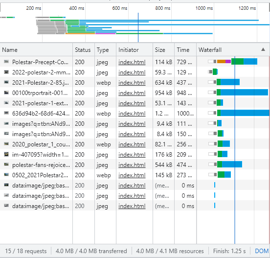

# Lazy Loading

A blog post revealed that there are six ways to optimize website assets loading: CDN Hosting, File Compression, File Concatenation, Minify Scripts, Parallel Downloads and Lazy Loading. In this project, we are looking at Lazy Loading.

HTML images and iFrames have an attribute called loading. We can do:

loading="lazy"

to request and load these images only when they're visibile in the viewport. This would improve initial loading times. 
Documentation: https://developer.mozilla.org/en-US/docs/Web/Performance/Lazy_loading 

On the other hand, I discovered there were libraries and scripts available online to achieve lazy loading. 
Documentation of one of many: https://github.com/verlok/vanilla-lazyload

If HTML already has Lazy Loading for images, what's the point of these additional libraries and scripts? This project will experiment with it.

# Control
The HTML document contains 15 images of different models of Polestar cars. There is no lazy loading technique applied yet. Ergo, all files are being requested and loaded ASAP.

This attempt processed, loaded, and displayed all 15 pictures immediately. 
176kB was transferred. 4.0MB resources were used. The task finished in 224 ms.