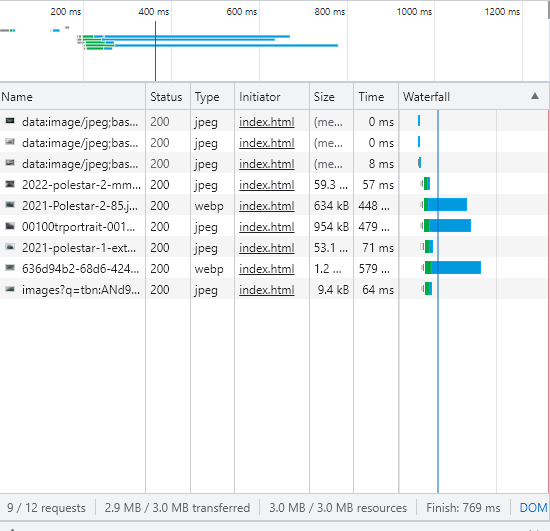
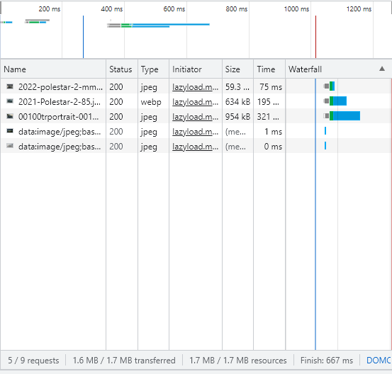

# LAZY LOADING
## INTRODUCTION
A blog post revealed that there are six ways to optimize website assets loading: CDN Hosting, File Compression, File Concatenation, Minify Scripts, Parallel Downloads and Lazy Loading. In this project, we are looking at Lazy Loading.

HTML images and iFrames have an attribute called loading. We can do:

loading="lazy"

to request and load these images only when they're visibile in the viewport. This would improve initial loading times. 
Documentation: https://developer.mozilla.org/en-US/docs/Web/Performance/Lazy_loading 

On the other hand, I discovered there were libraries and scripts available online to achieve lazy loading. 
Documentation of one of many: https://github.com/verlok/vanilla-lazyload  
Tutorial: https://www.youtube.com/watch?v=JaA7jQoR1Jc&ab_channel=iEatWebsites 

If HTML already has Lazy Loading for images, what's the point of these additional libraries and scripts? This project will experiment with it.

## Control
The HTML document contains 15 images of different models of Polestar cars. There is no lazy loading technique applied yet. Ergo, all files are being requested and loaded ASAP.

  

This attempt processed, loaded, and displayed all 15 pictures immediately. 
4.0MB was transferred. 4.0MB resources were used. The task finished in 1.25s.

## Attempt 1
I gave each image attribute
loading: "lazy"

  

Interestingly enough, this method did reduce the initial loading time.
I don't understand why there are still list items that are showing up in this list. More research is required.

## Attempt 2
  
Instead of using HTML's loading attribute, I used scripting from a GitHub repository.
I found this interesting for a few reasons. This attempt's finish time is similar to the previous one. Are they equally effective?
But this attempt is different from the previous one because it initially loads fewer photos than the previous attempt. But the finish time is roughly the same. I'll have to conduct more research.